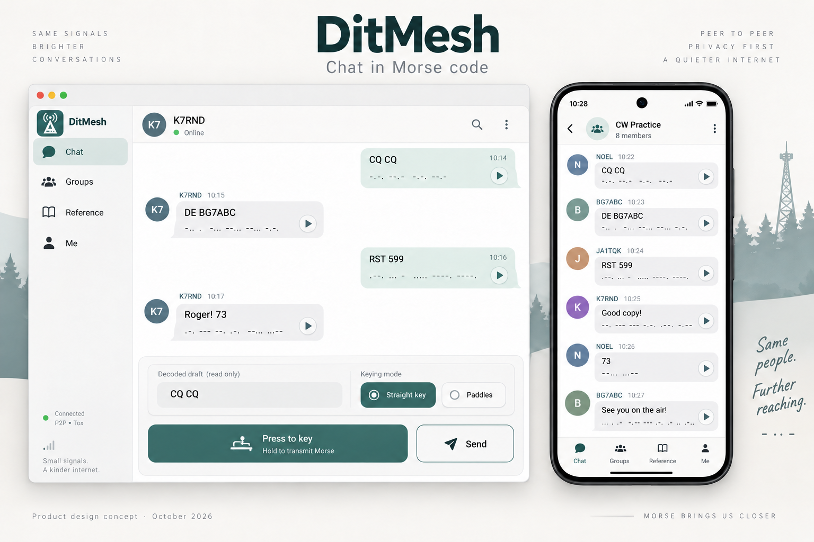
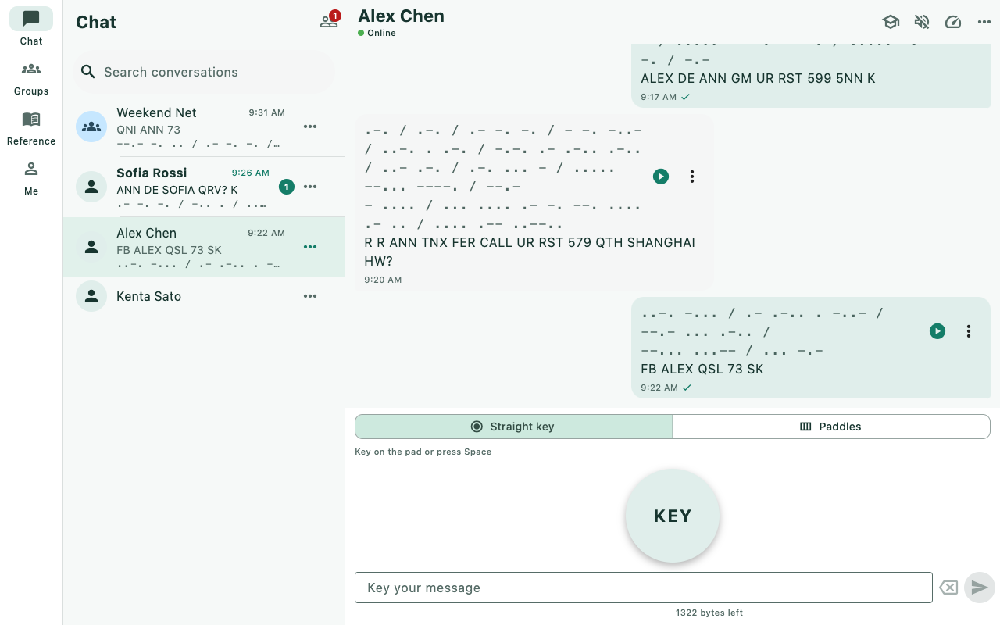
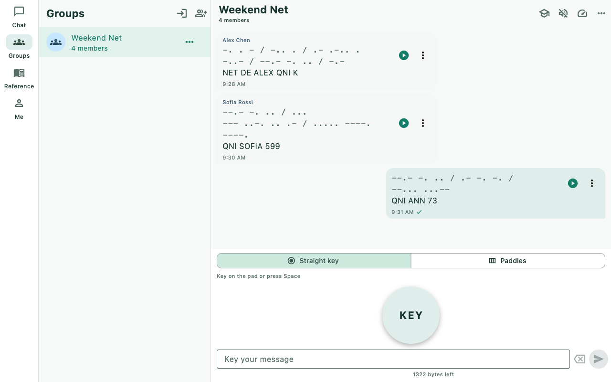

[简体中文](./README.zh-CN.md)

# DitMesh

**Chat in Morse code.** DitMesh is a serverless Morse messenger over the [Tox](https://tox.chat) peer-to-peer network. Key messages with a straight key or iambic paddles, by touch or physical keyboard, in direct conversations and group nets. No phone number, e-mail or central registration is needed: your identity is generated on your device.

DitMesh is the chat application; [MorseCQ](https://github.com/agentx-icu/morsecq) is the companion offline trainer. The apps have separate identifiers and data directories. Both are preparing their first release.



*Product design concept; actual application captures are listed separately below.*

## Features

The main destinations are **Chat / Groups / Reference / Me** on phones, tablets and desktops.

- **Morse-only composing:** touch/keyboard straight key and iambic paddles, read-only decoded draft, Morse preview, pre-listen, correction and byte limit. There is no text-typing chat mode.
- **Direct chat:** Tox ID and QR contacts, friend requests, local notes to yourself, unread counts, drafts and persistent history.
- **Group nets:** create, join by group ID, invite, manage members and rejoin after restart. Group messages use the same Morse composer.
- **Playback and practice:** listener-selected speed and Farnsworth spacing, audio/haptic/flash playback, listen-first/reveal and listen-only modes, copy exercises, saved practice material and group practice.
- **Message management:** history search, filters, jump to result, bookmarks, queued-send cancellation and failed-send retry without duplicate bubbles.
- **Device identity and backups:** password-protected identity, encrypted export/restore with preview, selective components, Tox profile import and current DitMesh backup restore.
- **Privacy and moderation:** peer-to-peer encrypted transport, local notifications, blocked peers and community guidelines. No messaging or push server.
- **Reference and key setup:** alphabet, prosigns, Q-codes, translator, Chinese telegraph-code interpretation and configurable device key bindings.
- **Network configuration:** official node catalogue, real per-node DHT probes, automatic/manual selection and desktop LAN hosting; network settings also work before unlocking an identity. [Node and LAN guide](doc/operations/NETWORK.md).
- **Appearance and languages:** ten interface locales; Classic Brass, Modern Calm, Night Radio, Paper Handbook and Fresh Cartoon styles with light/dark/system brightness. Automated captures and a real-font visual matrix cover languages and styles.
- **Desktop integration:** responsive panes, window persistence, tray, unread badge and notification routing; selected signal-tower/Morse icon C across platform resources.

Messages use the existing Tim2Tox plain-text wire protocol, so clients such as [toxee](https://github.com/agentx-icu/toxee) can read them. DitMesh generates Morse playback locally. Real keyed timing and live keying over the network are future upstream work.

Automatic mode starts immediately with saved selection and numeric fallback nodes, then refreshes the [official Tox list](https://nodes.tox.chat/) in the background; manual node settings are preserved. Both peers must be running and reachable for delivery. Messages for an offline peer wait in a local durable queue; an application that is closed cannot receive server push. Native-backend startup errors are visible; demo services are enabled only with the explicit test define.

## Screenshots

<table><tr>
<td></td>
<td></td>
</tr></table>

[Capture gallery and platform coverage](doc/screenshots/README.md) · [Capture languages/styles](tool/screenshots/README.md) · [Product design](doc/designs/product-2026-10-08/README.md) · [Selected icon C](doc/designs/icon-2026-10-08/README.md)

Captures come from the real Flutter UI with explicitly seeded demo data. Product concepts are illustrations, not evidence of a successful build. Unavailable-platform captures are generated by CI rather than relabelled from another app.

## Build and run

Pinned toolchain: **Flutter 3.41.9 / Dart 3.11.5**. Android, iOS, macOS, Linux and Windows are supported; browser chat is not supported by the native Tox transport.

```bash
git clone --recurse-submodules https://github.com/agentx-icu/ditmesh.git
cd ditmesh
dart run tool/bootstrap_deps.dart
dart pub get
bash tool/ci/build_tim2tox.sh --target macos-arm64
cd apps/ditmesh
flutter run -d macos
```

For a deliberate UI demo, use `--dart-define=DITMESH_FAKE_BACKEND=true`. Production builds use the real backend and require its platform library.

See [build and packaging](doc/operations/BUILD_AND_DEPLOY.md), [release requirements](doc/release/APP_STORE.md), [application responsibilities](doc/APP_SPLIT.md) and the [test pyramid](doc/testing/TEST_PYRAMID.md).

## Development checks

Run dependency resolution at the workspace root, not inside a package:

```bash
dart run tool/check_complexity.dart
dart run tool/import_guard.dart
dart run tool/ui_literal_guard.dart
dart analyze --fatal-infos tool
for dir in packages/* apps/*; do
  [ -f "$dir/pubspec.yaml" ] || continue
  flutter analyze "$dir"
  [ -d "$dir/test" ] || continue
  (cd "$dir" && flutter test --exclude-tags=needs-native)
done
```

Only `ditmesh_chat` imports the Tim2Tox/Tencent compatibility adapter. Pure Morse packages stay independent of Flutter. The repository retains GPL-3.0 and the shared engine's third-party notices.

## Releases and remaining verification

GitHub Actions builds the native transport and required applications, packages assets and produces checksums. A `v*` tag creates a **draft** GitHub Release after the validation gates. iOS packages are unsigned; store signing and macOS notarization require owner credentials. Experimental ARM architectures and physical-device checks are described in the [handover](doc/HANDOVER.md).

The approved scope and implementation record are in [the split plan](doc/plans/2026-10-08-chat-migration.md). Local and CI evidence is recorded in [validation](doc/VALIDATION.md); do not infer all-platform success from this README.

## Privacy, support and licence

[Privacy](site/privacy.md) · [Community guidelines](site/terms.md) · [Support](https://github.com/agentx-icu/ditmesh/issues) · [GPL-3.0](LICENSE)
