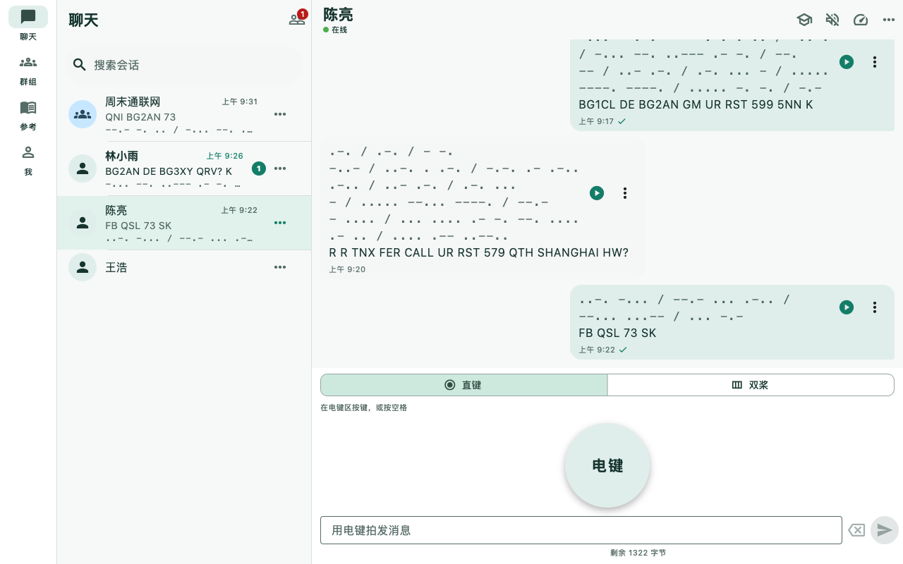
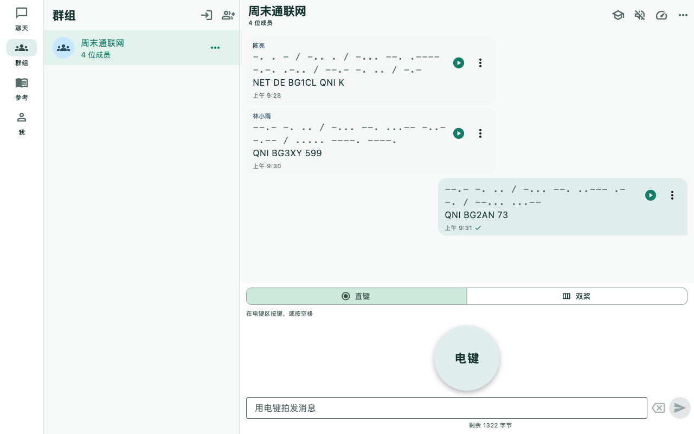

[English](./README.md)

# DitMesh

**用 Morse Code 聊天。** DitMesh 是基于 [Tox](https://tox.chat) 点对点网络、没有聊天服务器的莫尔斯电码聊天应用。通过触摸或物理键盘操作直键、双桨，在单聊和群组中发报。不需要手机号、邮箱或中心服务器注册；身份密钥在设备本地生成。

离线学习和练习 Morse Code，请使用 [MorseCQ](https://github.com/agentx-icu/morsecq)。


*产品设计概念图。*

## 功能

手机、平板和桌面使用 **聊天 / 群组 / 参考 / 我的** 四个主入口。

- **只能用 Morse 发消息**：触摸或键盘直键/双桨输入，只读解码草稿、点划预览、发送前试听、纠错与字节限额；没有普通文字键入聊天模式。
- **单聊**：Tox ID 与二维码加好友、好友申请、发给自己的笔记、未读计数、草稿、持久化历史。
- **群聊**：新建、通过群 ID 加入、邀请、成员管理、重启后重入；群消息使用同一套 Morse 输入。
- **播放与练习**：接收者自选速度和 Farnsworth 间距，音频/震动/闪光播放、先听后揭晓、纯听模式、抄收练习、保存学习材料和群内练习。
- **消息管理**：历史搜索、过滤、跳转、书签、取消尚未发送的队列消息、失败重试且不重复创建消息气泡。
- **身份与备份**：身份密码保护、完整加密导出与恢复预览、选择恢复组件、`.tox` 身份文件导入及 DitMesh 备份恢复。
- **隐私与屏蔽**：点对点加密传输、本地通知、屏蔽联系人及社区准则；没有聊天或推送服务器。
- **参考与电键**：字母、程序信号、Q 简语、译码、中文电报码解读及设备按键配置。
- **网络配置**：官方节点目录、节点可达性测试、自动/手动选择、桌面局域网托管；解锁身份前也可设置网络。见[节点与局域网指南](doc/operations/NETWORK.zh-CN.md)。
- **外观与语言**：十种界面语言，Classic Brass、Modern Calm、Night Radio、Paper Handbook、Fresh Cartoon 五种风格，明亮/暗色/跟随系统。
- **桌面体验**：自适应会话面板、窗口记忆、托盘、未读角标和通知跳转。

DitMesh 可与 [toxee](https://github.com/agentx-icu/toxee) 等 Tox 客户端互通，接收到的消息按你选择的速度和间距播放。

自动模式使用已保存或默认节点，后台刷新[官方 Tox 列表](https://nodes.tox.chat/)；手动配置保持有效。双方应用都运行且网络可达时才能送达。对方离线时消息保留在待发送队列，恢复连接后继续发送。接收消息时请保持应用运行。

## 截图

<table><tr>
<td></td>
<td></td>
</tr></table>

[截图与平台覆盖](doc/screenshots/README.zh-CN.md) · [按语言/风格采集](tool/screenshots/README.zh-CN.md) · [产品设计](doc/designs/product-2026-10-08/README.zh-CN.md) · [应用图标](doc/designs/icon-2026-10-08/README.zh-CN.md)

截图展示演示会话。

## 构建与运行

固定工具链：**Flutter 3.41.9 / Dart 3.11.5**。支持 Android、iOS、macOS **13.0 及以上**（Intel/ARM）、Linux、Windows；原生 Tox 传输不支持浏览器聊天。

```bash
git clone --recurse-submodules https://github.com/agentx-icu/ditmesh.git
cd ditmesh
dart run tool/bootstrap_deps.dart
dart pub get
bash tool/ci/build_tim2tox.sh --target macos-arm64
cd apps/ditmesh
flutter run -d macos
```

参见[构建与打包](doc/operations/BUILD_AND_DEPLOY.zh-CN.md)、[发布要求](doc/release/APP_STORE.zh-CN.md)、[应用职责](doc/APP_SPLIT.zh-CN.md)、[测试金字塔](doc/testing/TEST_PYRAMID.zh-CN.md)。

## 开发检查

在工作区根目录解析依赖，不在子包单独运行：

```bash
dart run tool/check_complexity.dart
dart run tool/import_guard.dart
dart run tool/ui_literal_guard.dart
dart analyze --fatal-infos tool
for dir in packages/* apps/*; do
  [ -f "$dir/pubspec.yaml" ] || continue
  flutter analyze "$dir"
  [ -d "$dir/test" ] || continue
  (cd "$dir" && flutter test --exclude-tags=needs-native)
done
```

## 隐私、支持与许可证

[隐私](site/zh-CN/privacy.md) · [社区准则](site/zh-CN/terms.md) · [问题反馈](https://github.com/agentx-icu/ditmesh/issues) · [GPL-3.0](LICENSE)
