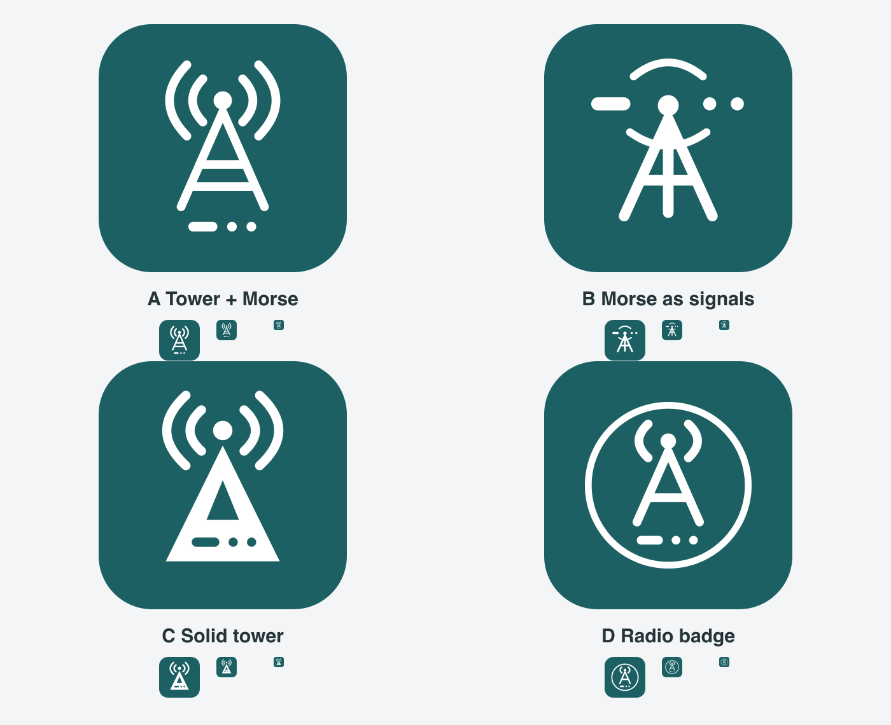

[English](./README.md)

# DitMesh 信号塔图标

应用图标以深青色和白色组合实心信号塔与 Morse `−··`（D）。大面积轮廓在小尺寸下保持清晰。

| 方案 | 造型 | 矢量源文件 |
|---|---|---|
| A | 信号塔、电波与点划 | [SVG](option-a.svg) |
| B | 点划组成发射信号 | [SVG](option-b.svg) |
| C — 应用图标 | 实心信号塔与点划镂空 | [SVG](option-c.svg) |
| D | 圆形无线电徽章 | [SVG](option-d.svg) |

每项包含 512px 预览，比较图也展示 64/32/16px 小尺寸效果。平台资源从[共用蒙版](../../../apps/ditmesh/icon/signal_tower_mask.svg)通过[应用图标生成器](../../../tool/gen_app_icons.dart)和[托盘生成器](../../../tool/gen_tray_icons.dart)生成。
